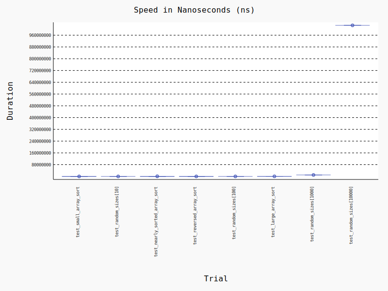

## Introduction
Insertion sort is one of the classic sorting algorithms to discuss as part of academic curiculum in computer science. The inefficient runtime performance compared to other algorithms, make other algorithms like heapsort more practical to use for use cases with sorting large datasets at scale.


## Best-Case Analysis
The best case performance occurs when the input array is already sorted in ascending order. In this situation, the insertion sort has O(n) comparisons to make, verifying the list is already sorted. The benchmarking shows this test completed in .051 milliseconds. In a nearly sorted array, the inner loop only executes when out of order pair is found.


## Worst-Case Analysis
The worst case performanc occurs when the input array is already sorted in descending order. In this situation, the insertion sort has O(n^2) comparisons to make because the outer and inner loop conditions always occurs. The benchmarking shows this test completes in .050 milliseconds.


## Average-Case Analysis
The average case performance is the same as the worst case, though with half as many elements O((n^2)/2) which simplifies to O(n^2).
For testing 4 inputs: `test_random_sizes[n]` with n ranging from 10 to 10,000. The average runtime was recorded to take 259 milliseconds.


## Space Complexity Analysis
The insertion sort has constant space complexity, allocation only two additional variables: `current`, which stores the value to be inserted in the current loop, and `position`, which is a pointer that is incremented for moving through the input array.


## Stability Analysis
The insertion sort algorithm is stable, allowing equal elemenents to maintain relative position. This is possible becuse of the `>=` operator:
```python
    while position >= 0 and numbers[position] > current:
```
`test_stable_sort` is included specifically to show stability of the insertion sort algorithm using input:
```python
 [
            (2, 'first'),   # First item with key=2
            (2, 'second'),  # Second item with key=2
            (1, 'third'),   # Smallest key
            (3, 'fourth'),  # Largest key
            (2, 'fifth')    # Third item with key=2
        ]
```

## Test Results


### About the Test Parameters
1. small array input size is 1000
2. mostly sorted array input size is 1000, with one element out of place
3. reversed array input size is 1000
4. large array input size is 10,000
5. random array input size ranges from 10 to 10000
```json
 "benchmarks": [
        {
            "name": "test_small_array_sort",
            "stats": {
                "min": 2.7290006983093916e-07,
                "max": 1.937499473569915e-06,
                "mean": 3.1732281370925486e-07,
                "stddev": 3.0331547411279304e-08,
                "rounds": 144572,
                "unit": "ns"
            }
        },
        {
            "name": "test_large_array_sort",
            "stats": {
                "min": 0.0005367080011637881,
                "max": 0.0005552079965127632,
                "mean": 0.0005425082024885341,
                "stddev": 7.2911531770666925e-06,
                "rounds": 5,
                "unit": "ns"
            }
        },
        {
            "name": "test_nearly_sorted_array_sort",
            "stats": {
                "min": 4.333299875725061e-05,
                "max": 0.0018353750056121498,
                "mean": 5.183997407285111e-05,
                "stddev": 3.135823452977264e-05,
                "rounds": 20426,
                "unit": "ns"
            }
        },
        {
            "name": "test_reversed_array_sort",
            "stats": {
                "min": 4.862500645685941e-05,
                "max": 5.970901111140847e-05,
                "mean": 5.0170604361414486e-05,
                "stddev": 2.038659568846837e-06,
                "rounds": 53,
                "unit": "ns"
            }
        },
        {
            "name": "test_random_sizes[10]",
            "stats": {
                "min": 1.7920101527124643e-06,
                "max": 1.7920101527124643e-06,
                "mean": 1.7920101527124643e-06,
                "stddev": 0,
                "rounds": 1,
                "unit": "ns"
            }
        },
        {
            "name": "test_random_sizes[100]",
            "stats": {
                "min": 8.537500980310142e-05,
                "max": 8.537500980310142e-05,
                "mean": 8.537500980310142e-05,
                "stddev": 0,
                "rounds": 1,
                "unit": "ns"
            }
        },
        {
            "name": "test_random_sizes[1000]",
            "stats": {
                "min": 0.009957041998859495,
                "max": 0.009957041998859495,
                "mean": 0.009957041998859495,
                "stddev": 0,
                "rounds": 1,
                "unit": "ns"
            }
        },
        {
            "name": "test_random_sizes[10000]",
            "stats": {
                "min": 1.027018875000067,
                "max": 1.027018875000067,
                "mean": 1.027018875000067,
                "stddev": 0,
                "rounds": 1,
                "unit": "ns"
            }
        }
    ]
```

## Efficiency
The insertion sort has mixed performance when considering efficiency. The benchmarking showed that the large array with input size of 10,000 completed in about .5 ms, which may be sufficient for sorting efforts where the data pre-processing takes longer than the sorting effort itelf. For input size of 1000 or less, the delta between the best and worst case performance is negligible.

| Qualities | Pros | Cons |
|-----------|------|------|
| Runtime Performance ||X|
| Memory Usage |X|||
| Length of Implementation |X|

### Comparison to Other Sorting Algorithms
Insertion sort offers equivalent performance in both time and space with bubble sort. Heapsort however outperforms both insertion sort and bubble sort with O(nlogn) time complexity and O(1) space complexity

## Practical Applications
Most programming languages include a built in sort algorithm. Aside from being asked to implement insertion sort as part of an interview, there is little practical value of insertion sort since there are more efficient sorting algorithms to use.

## Improvements and Variations
If insertion sort is encountered in production code, consider it an opportunity to improve runtime performance by refactoring using another sorting algorithm and there is a complaint about performance.

A more interesting algorithm to study is perhaps the bitonic sort, which can achieve better runtime performance O(log^2n) which at the expense of additional compute resources, namely graphic processing units. For large enterprises running at hyperscale i.e. cloud service providers, there might be business incentives to reduce operating costs by implementing the most efficient sorting implementation.

## Conclusion
Insertion sort is one of several sorting algorithms that can be considered for organizing data. Due to its runtime complexity of O(n^2), insertion sort, is not ideal for sorting large data sets at scale. However, the space complexity of insertion sort is O(1), which perhaps could be useful for memory constrained applications where runtime performance can be sacrificed. Additionally, insertion sort is considered stable, allowing for equal values to remain in relative position.