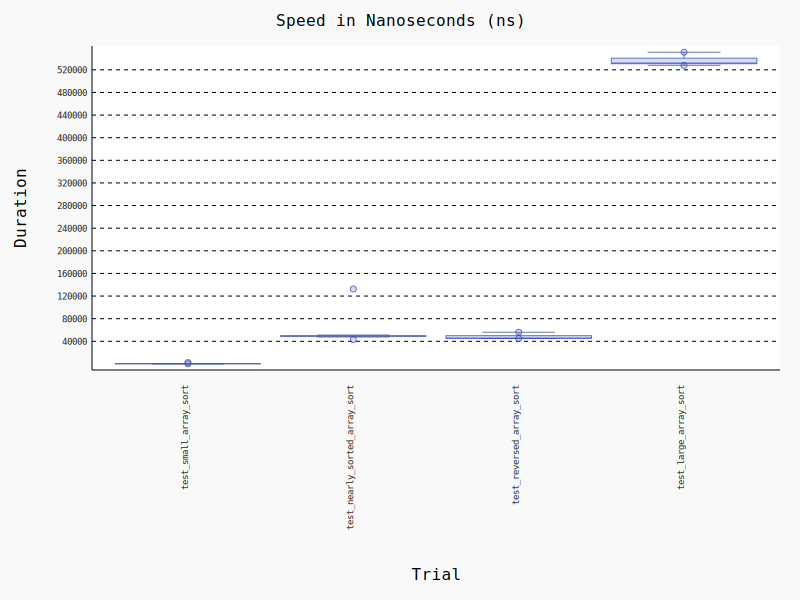

## Introduction
Insertion sort is one of the classic sorting algorithms to discuss as part of academic curiculum in computer science. The inefficient runtime performance compared to other algorithms, make other algorithms like heapsort more practical to use for use cases with sorting large datasets at scale.


## Best-Case Analysis
The best case performance occurs when the input array is already sorted in ascending order. In this situation, the insertion sort has O(n) comparisons to make, verifying the list is already sorted.


## Worst-Case Analysis
The worst case performanc occurs when the input array is already sorted in descending order. In this situation, the insertion sort has O(n^2) comparisons to make because the outer and inner loop conditions always occurs.


## Average-Case Analysis
The average case performance is the same as the worst case, though with half as many elements O((n^2)/2) which simplifies to O(n^2)


## Space Complexity Analysis
The insertion sort has constant space complexity, allocation only two additional variables: `current`, which stores the value to be inserted in the current loop, and `position`, which is a pointer that is incremented for moving through the input array.


## Stability Analysis
The insertion sort algorithm is stable, allowing equal elemenents to maintain relative position. This is possible becuse of the `>=` operator:
```python
    while position >= 0 and numbers[position] > current:
```

## Test Results


### About the Test Parameters
1. small array input size is 1000
2. mostly sorted array input size is 1000, with one element out of place
3. reversed array input size is 1000
4. large array input size is 10,000

```json
"benchmarks": [
        {
            "name": "test_small_array_sort",
            "stats": {
                "min": 2.708497049752623e-07,
                "max": 2.349999704165384e-06,
                "mean": 3.098708584383453e-07,
                "stddev": 3.315219182547031e-08,
                "rounds": 149993,
                "unit": "ns"
            }
        },
        {
            "name": "test_large_array_sort",
            "stats": {
                "min": 0.0005279169999994338,
                "max": 0.0005511250055860728,
                "mean": 0.0005360002018278464,
                "stddev": 9.071807726732025e-06,
                "rounds": 5,
                "unit": "ns"
            }
        },
        {
            "name": "test_nearly_sorted_array_sort",
            "stats": {
                "min": 4.312500823289156e-05,
                "max": 0.00013254099758341908,
                "mean": 4.930725716719328e-05,
                "stddev": 2.658345765888921e-06,
                "rounds": 21410,
                "unit": "ns"
            }
        },
        {
            "name": "test_reversed_array_sort",
            "stats": {
                "min": 4.4832995627075434e-05,
                "max": 5.60000044060871e-05,
                "mean": 4.719435242737678e-05,
                "stddev": 2.751197588658363e-06,
                "rounds": 54,
                "unit": "ns"
            }
        }
    ]
```

## Efficiency
The insertion sort has mixed performance when considering efficiency.

| Qualities | Pros | Cons |
|-----------|------|------|
| Runtime Performance ||X|
| Memory Usage |X|||
| Length of Implementation |X|


## Practical Applications
Most programming languages include a built in sort algorithm. Aside from being asked to implement insertion sort as part of an interview, there is little practical value of insertion sort since there are more efficient sorting algorithms to use.

## Improvements and Variations
If insertion sort is encountered in production code, consider it an opportunity to improve runtime performance by refactoring using another sorting algorithm and there is a complaint about performance.

## Conclusion
Insertion sort is one of several sorting algorithms that can be considered for organizing data. Due to its runtime complexity of O(n^2), insertion sort, is not ideal for sorting large data sets at scale. However, the space complexity of insertion sort is O(1), which perhaps could be useful for memory constrained applications where runtime performance can be sacrificed. Additionally, insertion sort is considered stable, allowing for equal values to remain in relative position.